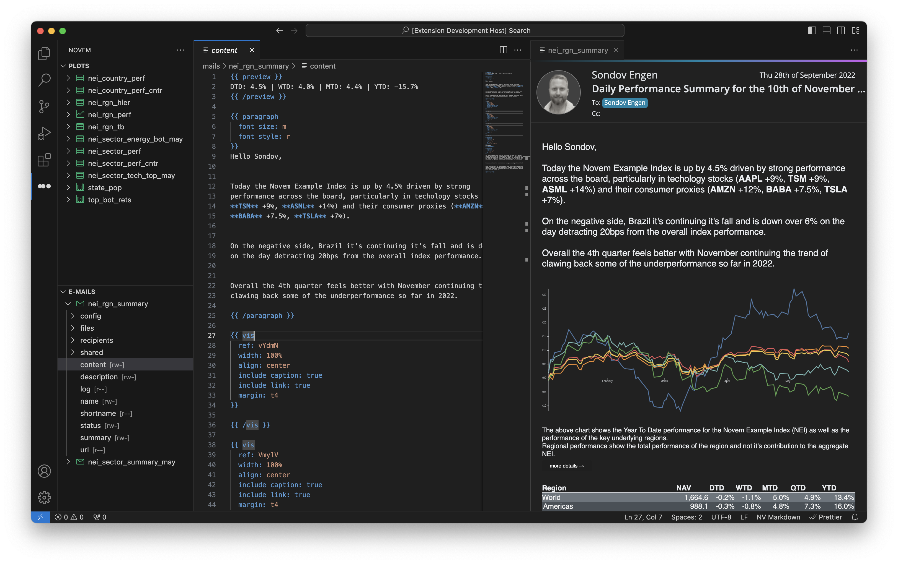

# novem - datavisualisation in your editor
[novem](https://novem.io/) is a datavisualisation platform for coders, create charts, documents, emails and reports right from your code. With novem for vs code you can now edit and preview all your novem visuals with your favourite tool.


## Installation

Install through VS Code extensions. Search for `novem`

[Visual Studio Code Market Place: novem](https://marketplace.visualstudio.com/items?itemName=novem.novem-vscode)

Can also be installed in VS Code: Launch VS Code Quick Open (Ctrl+P), paste the following command, and press enter.

```
ext install novem.novem-vscode
```

## Getting started
You'll need a valid novem account and to have setup a novem configuration on your system.

```
pip install novem
novem --init
```
## Editing your visuals
Navigate through and open the relevant visuals using the novem bar and everything should work just like normal.


