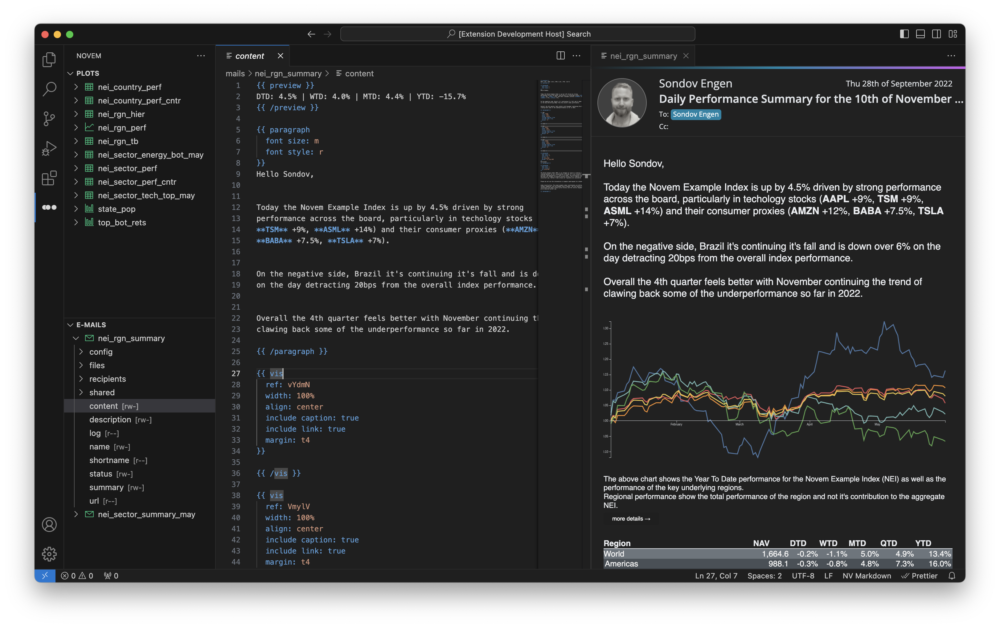

# novem - datavisualisation in your editor

[novem](https://novem.io/) is a datavisualisation platform for coders, create
charts, documents, emails and reports right from your code. With novem for VS
Code you can browse, create, edit and preview everything on your novem account
without leaving the editor.



## Installation

Install through VS Code extensions. Search for `novem`

[Visual Studio Code Market Place: novem](https://marketplace.visualstudio.com/items?itemName=novem.novem-vscode)

Can also be installed in VS Code: Launch VS Code Quick Open (Ctrl+P), paste
the following command, and press enter.

```
ext install novem.novem-vscode
```

## Getting started

All you need is a [novem account](https://novem.io/) — the extension handles
sign-in itself. Open the novem bar in the activity bar and click **Sign in to
Novem** (or run `novem: Login` from the command palette), then complete the
login in your browser.

If you already use the novem CLI or one of the novem libraries, the extension
picks up your existing configuration and you're signed in from the start.

## Profiles

You can be signed in to several accounts — or several environments — at once,
each stored as a profile in the shared novem configuration:

-   `novem: Login New Profile` signs in with another account and saves it as a
    new profile
-   `novem: Select Profile` switches the active profile
-   `novem: Edit Config File` opens the configuration for manual fine-tuning

All of these are available from the command palette and from the `⋯` menu on
the novem views.

## Working with your visuals

The novem bar lists everything on your account across six resource types:
**plots**, **e-mails**, **grids**, **documents**, **jobs** and **repos** (the
last two appear once your account has any).

Every view has a `+` button for creating new resources, and the right-click
menu lets you view, edit, rename and delete existing ones. Some resource
types have extra actions:

-   **E-mails** can be tested and sent: _Test_ delivers the mail to your own
    address, _Send_ shows a recipient summary for confirmation before mailing
    everyone on the to/cc/bcc lists.
-   **Jobs** can be run directly from the tree.
-   **Repos** can be cloned to your machine.

## Editing and previews

Expanding a resource in the tree exposes its files. They are read straight
from the novem API and written back when you save — no local checkout, your
changes are live the moment you hit save.

_View_ opens a live preview of a plot, e-mail, grid or document in an editor
tab, so you can keep the content on one side and the rendered result on the
other.

Content files (e-mail and document content, grid layouts and mappings) get
novem-flavoured markdown highlighting out of the box, and the same
`nv_markdown` syntax is available for local `.nvm` and `.nvmd` files.
